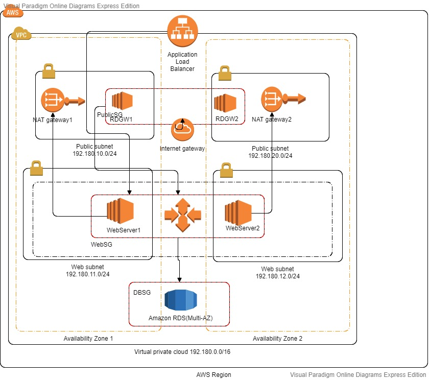

# TechTestApp

This repository holds the code and instructions to deploy the TechTestApp using AWS cloudformation.

The overall deployment steps are:
1. Ensure the application is built well on local machine using the dev team instructions.  
2. Ensure the built package uploaded to an S3 bucket.  
3. Ensure that the Auto scaling group that will spin up  new instances should have a role (with the appropriate S3  bucket policy) to pickup the package from S3 and deploy the same.  

Contents of the repository:  
1. AWS_CF.yml --> Cloudformation  
2. images/AWS_Architecture.png --> Architecture of the AWS infrastructure.
3. images/AWS_CF_architecture.png --> Architecture as built in AWS Cloudformation.
4. TechTestApp.tar --> The complete source code with compiled package.
4. Readme.md --> Information about the solution.

There are two stages involved in setting up TechTestApp on AWS :  
1. Building the application locally using go (instructions for the same are located here : https://github.com/servian/TechTestApp/blob/master/doc/readme.md)  
2. Deploying the same via AWS cloudformation.  

# Prerequisites  

Ensure the below prerequisites are met before building and deploying the application:  

1.   Golang is installed on the system.  
2.  Dep is installed on the system.  
3. AWS CLI is installed and configured with an IAM user that has appropriate permissions to spin up a complete VPC using cloudformation templates and also upload package to s3 bucket in the AWS account.  
4.  OS is updated with the latest patches.    

# Building the application.  

We can use the below method to build the application using go:  

1.  Prepare a shell script that contains all the build steps ( as kept in build/....sh).  
2. Schedule a jenkins job on the local build server that will trigger this script as soon as it observes a code change in the repository https://github.com/servian/TechTestApp  
3. Trigger the jenkins job mentioned below to spin up a new AWS environment.  

# Deploy the AWS infrastructure with the newly built app.  

1. Setup a jenkins job on the build server that will pull the AWS_CF.yaml abd run the below CLI command to spin up a Private VPC in the AWS account.  

aws cloudformation create-stack --template-body file:///var/lib/jenkins/workspace/SpinupAWSEnvironment/AWS_CF.yaml --stack-name TestTechApp --parameters ParameterKey=VPCName,ParameterValue=TechTest ParameterKey=KeyName,ParameterValue=k8s-kp ParameterKey=VPCCidr,ParameterValue=192.180.0.0/16 ParameterKey=PubSubnetACidr,ParameterValue=192.180.10.0/24 ParameterKey=PubSubnetBCidr,ParameterValue=192.180.20.0/24 ParameterKey=WebSubnetACidr,ParameterValue=192.180.11.0/24 ParameterKey=WebSubnetBCidr,ParameterValue=192.180.21.0/24 ParameterKey=DBName,ParameterValue=app ParameterKey=DBUser,ParameterValue=postgres ParameterKey=DBPassword,ParameterValue=changeme ParameterKey=MultiAZ,ParameterValue=false ParameterKey=DBAllocatedStorage,ParameterValue=20 ParameterKey=DBInstanceClass,ParameterValue=db.t2.micro ParameterKey=InstanceType,ParameterValue=t2.micro --region ap-southeast-2 --capabilities CAPABILITY_NAMED_IAM          

*Note : Due to security reasons , better to pass the values for these parameters as Jenkins parameters.  

            
    # AWS Architecture

     
                                                  
                                                    
                                                      
                                                        

               

